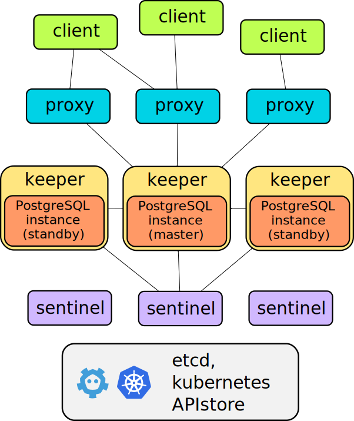

# Hysteron Architecture and Requirements

## Components

Hysteron is composed of 3 main components

* keeper: it manages a PostgreSQL instance converging to the clusterview
  provided by the sentinel(s).
* sentinel: it discovers and monitors keepers and calculates the optimal
  clusterview.
* proxy: the client's access point. It enforce connections to the right
  PostgreSQL master and forcibly closes connections to old masters.

## Requirements

### Keepers

Every keeper MUST have a different UID that can be manually provided
(`--uid` option) or will be generated. After the first start the keeper id
(provided or generated) is saved inside the keeper data directory.

Every keeper MUST have a persistent data directory (no ephemeral volumes
like k8s `emptyDir`) or you'll lose your data if all the keepers are stopped
at the same time (since at restart no valid standby to failover will be
available).

If you're providing the keeper's uid in the command line don't start a new
keeper with the same id if you're providing a different data directory
(empty or populated) since you're changing data out of the hysteron control
causing possible data loss or strange behaviors.

### Sentinel and proxies

Sentinels and proxies don't need a local data directory but only use the
store. The sentinels and proxies uids are randomly generated at every
process start to avoid possible collisions.

### Store

Currently the store can be etcd v3 or Kubernetes. Hysteron uses their
consistency features to persist cluster data and coordinate leader election.

The store should be highly available (at least three nodes).

When a hysteron component is not able to read (quorum consistent read) or
write to a quorate partition of the store (the hysteron component is
partitioned, the store is partitioned, the store is down etc...) it will
just retry talking with it.

In addition, the hysteron proxy, to avoid sending client connections to a
partioned master, will drop all the connections since it cannot know if the
cluster data has changed (for example if the proxy has problems reading from
the store but the sentinel can write to it).

## etcd v3 store backend

If etcd becomes partitioned (network partition or store nodes dead/with
problems), thanks to the raft protocol, only the quorate partition can
accept writes.

Every hysteron executable has a `--store-prefix` option (defaulting to
`hysteron/cluster`) to set the store path prefix. The etcd v3 backend has a
flat namespace, so the prefix is kept as provided. Prefixes with and without
a starting `/` are different and both valid.

### etcdv3 compaction

When using etcdv3 you must periodically compact the keyspace to avoid
storage space exhaustion. Hysteron doesn't need historical key values but
won't compact the etcdv3 store since this operation is global and the etcd
cluster could be shared with other products that requires historical values.
Compaction could be triggered in multiple ways. If possible we suggest to
enable automatic compaction (revision or periodic policy based on your etcd
operations baseline).

Compaction alone does not immediately return disk space to the host filesystem.
Run etcd defragmentation as part of regular maintenance (normally during
low-traffic windows and one member at a time, following etcd operational
guidance).

If your etcd cluster is shared with other systems, define compaction retention
for the whole cluster intentionally, because this is a global policy and may
affect workloads that rely on key history.

Refer to the current etcd maintenance documentation:
https://etcd.io/docs/v3.5/op-guide/maintenance/

## kubernetes store backend

The kubernetes store relies on the kubernetes api server and uses kubernetes
resources to save the clusterdata, components discovery and status report.

The k8s API server must be configured with enabled etcd quorum read (should
be the default in standard kubernetes installations since the option to
remove it is deprecated).

**NOTE**: a kubernetes based store will share the kubernetes API server with
all the other k8s cluster resources. If the API servers are overloaded and
doesn't answer in time, as explained above, the proxies will, after a
timeout, close connections to the master keeper. The same will happen if
you're updating you kubernetes cluster and you have the need to shutdown all
your API servers. A dedicated store, like an etcd cluster, will probably be
more reliable and avoid the proxies closing connection and impacting you
application availability.

By default, clusterdata is stored in a ConfigMap resource named
`hysteron-$CLUSTERNAME`. Pay attention to don't delete this ConfigMap
or you'll lose your cluster data. The legacy ConfigMap backend stores
clusterdata inside a metadata annotation called `hysteron-clusterdata`. Users
should not manually modify this resource.

Use `--k8s-resource-name` to change the Kubernetes object name used for
clusterdata and sentinel leader election. The value supports `{cluster}` as
a cluster-name placeholder and must be a valid Kubernetes DNS label.

As an alternative, `--k8s-resource-kind=secret` stores clusterdata in an
opaque Secret with the same `hysteron-$CLUSTERNAME` name, using the
`clusterdata` data key. This allows a different Kubernetes RBAC policy and
reduces accidental visibility, but it is not a replacement for Kubernetes
encryption-at-rest.

Sentinel leader election uses a `coordination.k8s.io/Lease` resource with
the same `hysteron-$CLUSTERNAME` name. Kubernetes RBAC must allow the
sentinel to get, create, and update leases.

To discovery hysteron components (keepers, proxies, sentinels) a lookup with
specific label selectors is executed. These labels must be correctly set on
the pod definition (see the [kubernetes example](/examples/kubernetes)).
They are:

`component` set to the component type: `hysteron-keeper`, `hysteron-sentinel`,
`hysteron-proxy`; `hysteron-cluster` set to the hysteron cluster name.

Every components also saves its state in an annotation of their own pod
called `hysteron-status`

`hysteron cluster ...` management commands may be executed inside a pod running
a Hysteron component or externally. They behave like `kubectl` when choosing how
to access the k8s API servers: when run inside a pod they use the pod service
account; when run externally they honor `$KUBECONFIG`, default to
`~/.kube/config`, and can be overridden with `--k8s-config`,
`--k8s-context`, and `--k8s-namespace`.

### Handling permanent loss of the store

If you have permanently lost your store you can create a new one BUT don't
restore its contents (at least the hysteron ones) from a backup since the
backed up data could be older than the current real state and this could
cause different problems. For example if you restore a hysteron cluster data
where the elected master was different than the current one, you can end up
with this old master becoming the new master.

The cleaner way is to reinitialize the hysteron cluster using the `existing`
`initMode` (see [Cluster Initialization](initialization.md)).

### PostgreSQL Users

Hysteron requires two kind of users:

* a superuser
* a replication user

The superuser is used for:

* managing/querying the keepers' controlled instances
* execute (if enabled) pg_rewind based resync

The replication user is used for:

* managing/querying the keepers' controlled instances
* replication between postgres instances

Currently trust (password-less) and md5 password based authentication are
supported. In the future, different authentication mechanisms will be added.

To avoid security problems (user credentials cannot be globally defined in
the cluster specification since if not correctly secured it could be read by
anyone accessing the cluster store) these users and their related passwords
must be provided as options to the hysteron keepers and their values MUST be
the same for all the keepers (or different things will break). These options
are `--pg-su-username`, `--pg-su-password/--pg-su-passwordfile`,
`--pg-repl-username` and `--pg-repl-password/--pg-repl-passwordfile`

Utilizing `--pg-su-auth-method/--pg-repl-auth-method` trust is not
recommended in production environments, but they may be used in place of
password authentication. If the same user is utilized as superuser and
replication user, the passwords and auth methods must match.

When a keeper initializes a new pg db cluster, the provided superuser and
replication user will be created.

### Exceeding postgres max_connections

When external clients exceeds the number of postgres max connections, new
replication connection will fail blocking standbys from syncing. So always
ensure to avoid this case or increase the max_connections postgres parameter
value.

Superuser connections will instead continue working until exceeding the
`superuser_reserved_connections` value. For this reason external connections
to the db as superuser should be avoided or they can exhaust the
`superuser_reserved_connections` blocking the keeper from correctly managing
and querying the instance status (reporting the instance as not healthy).
